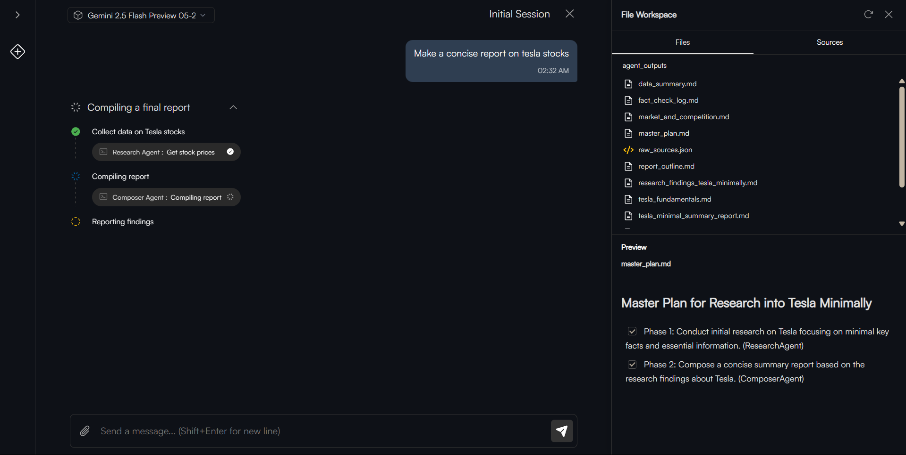
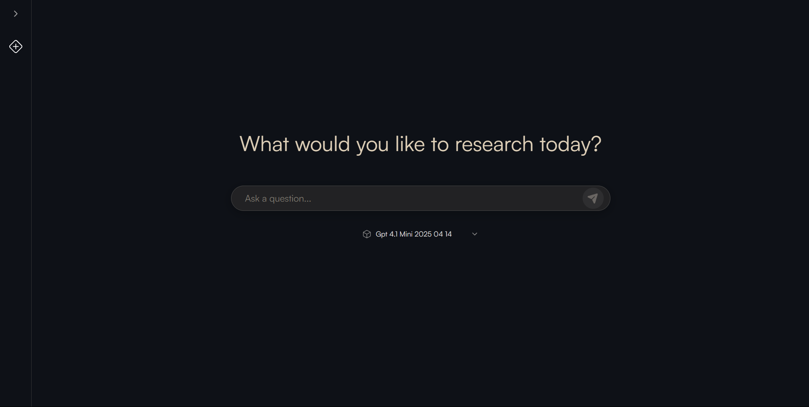
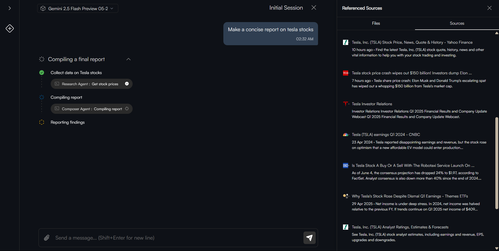

# **Cerno : Agentic Deep Research**


<a href="https://www.producthunt.com/products/cerno-agentic-local-deep-research?embed=true&utm_source=badge-featured&utm_medium=badge&utm_source=badge-cerno&#0045;agentic&#0045;local&#0045;deep&#0045;research" target="_blank">
  
</a>

Cerno is an open-source workspace for conducting **deep**, **multi-step** research and analysis using autonomous AI agents. Designed for developers and researchers who demand **analytical transparency**, Cerno exposes every reasoning step—from prompt decomposition to final synthesis—so you can observe, debug, and steer complex agentic workflows with confidence.



## 📚 Table of Contents

1. [Highlights](#-highlights)
2. [Local-First Principles](#-local-first-principles)
3. [Active Development & Community](#️-active-development--community)
4. [Prerequisites](#-prerequisites)
5. [Getting Started](#-getting-started-local-cli)
6. [Post-Migration Setup](#-post-migration-setup)
6. [Docker Installation](#docker-installation)
8. [CLI Reference](#️-cli-reference)
9. [Project Structure](#-project-structure)
10. [Screenshots](#-screenshots)
11. [Use Cases](#-use-cases)
12. [Roadmap](#-roadmap)
13. [Security & Privacy](#-security--privacy)
14. [Metrics & Benchmarks](#-metrics--benchmarks)
15. [Contributing](#-contributing)
16. [License](#-license)

---

## 🚀 Highlights

* **Model-Agnostic Core**: Effortlessly switch between premier LLMs (OpenAI, Google Gemini, Anthropic, DeepSeek) or run local models via Ollama.
* **Zero-Config Setup**: One CLI, one command—automatically create a virtual environment, install dependencies, and configure your workspace.
* **Transparent Execution Plan**: Visualize each agent task as it moves through Pending → Running → Success/Error states in real time.
* **Verifiable Artifacts**: Every source, webpage, and generated file (reports, code, data) is tracked and organized for easy auditing.
* **Adaptive Depth**: Simple queries spawn lightweight plans; complex directives trigger multi-agent, multi-tool orchestrations.
* **Token & Cost Optimization**: A manager-worker agent architecture balances quality and cost. Get a complete cost breakdown upon task completion.
* **Local-First Ethos**: Work offline, retain full control of your data, and avoid vendor lock-in. Cerno’s local-first architecture ensures your research stays where you want it: on your machine.

---

## 🌱 Local-First Principles

Cerno embraces a **local-first** philosophy:

1. **Data Sovereignty**: All research artifacts—notes, reports, intermediate files—live on your local drive by default.
2. **Offline Capability**: Core features work without internet. Use local LLMs (via Ollama) for research when connectivity is limited.
3. **Privacy & Security**: Sensitive prompts and outputs never leave your machine unless explicitly configured.
4. **Interoperability**: Write, export, and share results in standard formats (Markdown, Jupyter notebooks, JSON) without proprietary lock-in.

---

## 🛡️ Active Development & Community

Cerno is under **active development**—we’re constantly pushing new features, performance optimizations, and integrations. Your feedback is invaluable:

* **Bug Reports**: Found an issue? Please open an issue on GitHub with detailed steps to reproduce.
* **Feature Requests**: Have a great idea? Share it as an issue or discussion ticket.
* **Contributions**: We welcome pull requests! See our [CONTRIBUTING.md](CONTRIBUTING.md) for guidelines on setting up your dev environment, coding standards, and how to submit changes.

Let’s build something amazing together! 🚀

## 📦 Prerequisites

* **Python** ≥ 3.10
* **Node.js** ≥ 18.x & **npm**

---

## 🚀 Getting Started (Local CLI)

1. **Clone the repo** (or download the repo)

   ```bash
   git clone https://github.com/divagr18/Cerno-Agentic-Local-Deep-Research.git
   cd Cerno-Agentic-Local-Deep-Research
   ```

2. **Run Migrations**

   ```bash
   # macOS/Linux
   chmod +x cerno
   ./cerno migrate
   #for detailed logs
   ./cerno migrate --verbose  

   # Windows
   .\cerno migrate
   #for detailed logs
   .\cerno migrate --verbose
   ```

3. **Post-Migration Setup**

After applying migrations, follow these steps to configure your environment and launch Cerno:

1. **Copy the `.env` template**

   ```bash
   cp .env.example .env
   ```

   Creates a fresh `.env` file. Open it and fill in your API keys (e.g., `OPENAI_API_KEY`, `GEMINI_API_KEY`) or local model settings for Ollama. 

   For now, we only support OpenAI, Gemini, Anthropic, Deepseek and local models on Ollama **that support tool calling**, but support for more models is coming in the next release.


2. **Activate the virtual environment**

   ```bash
   venv\Scripts\activate   # Windows PowerShell/CMD  
   source venv/bin/activate    # macOS/Linux
   ```

   Ensures that Cerno’s dependencies and CLI are available in your current shell.

3. **Start Cerno**

   ```bash
   cerno start
   ```

   Launches both the Django backend and the React frontend. Once running, open [http://localhost:5173](http://localhost:5173) in your browser.

4. **List all commands**

   ```bash
   cerno --help
   ```

   Displays all available CLI commands and options.

---

## 🐳 Docker Installation

Prefer containerized workflows? Follow these steps:

1. Clone and set up `.env` as above.
2. Build and launch with Docker Compose:

   ```bash
   docker-compose up --build
   ```
3. Visit [http://localhost:5173](http://localhost:5173).

---

## 🛠️ CLI Reference

| Command                     | Description                         |
|-----------------------------|-------------------------------------|
| `cerno --help`              | Show all commands and usage details |
| `cerno setup`               | Re-run the full automated setup     |
| `cerno migrate`             | Apply database migrations           |
| `cerno start`               | Launch backend & frontend           |
| `cerno start --no-frontend` | Launch only the Django backend      |

---

## 📁 Project Structure

```
├── cerno             # CLI bootstrap scripts
├── cerno_cli.py      # Click-based command definitions
├── api/              # Django backend
│   ├── core/         # Settings, wsgi, asgi
│   ├── api/          # Views, serializers, URLs
│   └── agents/       # Agent definitions & tools
├── frontend/         # React + Vite app
├── agent_outputs/    # Generated reports, code, data
├── knowledge_sources/# Ingested docs for knowledge base
├── pyproject.toml    # Dependencies & CLI entry point
└── docker-compose.yml
```

---

## 📸 Screenshots

<details>
<summary>Expand to view screenshots</summary>






</details>

---

## 💼 Use Cases

* **Academic Research**: Automate literature reviews, data extraction, and report generation.
* **Market Analysis**: Compile insights from news sources, financial data, and social media.
* **Competitive Intelligence**: Track competitor tooling and summarize key findings.
* **Product Development**: Prototype multi-agent workflows for user testing and iterative design.

---

## 📈 Roadmap

* **v1.1** (Q3 2025): More integrations, advanced visualization modules, and collaborative workspaces.
* **v1.2** (Q4 2025): Plugin support, permissioned sharing, and audit trails.
* **Future**: Community-driven integrations, mobile-first UI, and expanded local model support.

---

## 🔒 Security & Privacy

* **Encrypted Secrets**: API keys and sensitive data encrypted at rest.
* **Audit Logs**: Full history of agent actions and user interactions.

---


## 🤝 Contributing

Contributions are welcome! Fork, develop, and submit a pull request. For major features, please open an issue first to discuss design and scope.

---

## 📜 License

Distributed under the **MIT License**. See [LICENSE](LICENSE.md) for details.
